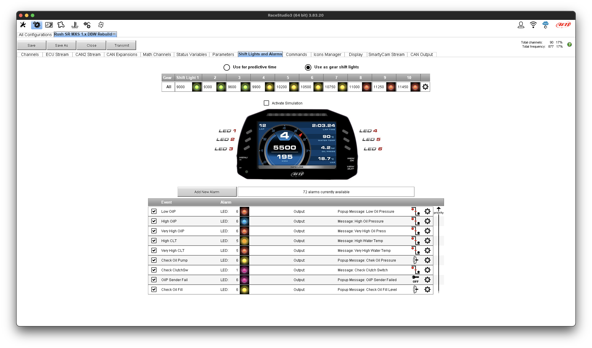
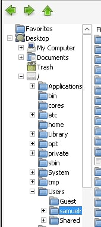

# RaceStudio 3 on a Mac — no Windows, no Parallels

Run AiM's **RaceStudio 3** on your Mac in its own window: your `.xrk` sessions, your device
configs and profiles, and a WiFi connection to your AiM logger or dash. Free. No Windows
license, no virtual machine.

*The real app, in a normal Mac window, on Apple Silicon.*

## Install — 3 steps, about 10 minutes

1. **Download `RaceStudio 3.dmg`** from the
   [**Releases**](https://github.com/Rush-Auto-Works/aim-racestudio3-mac/releases) page and open it.
2. **Drag the `AiM` folder onto Applications** (the arrow shows you where).
3. **Open RaceStudio 3** from **Applications ▸ AiM**.

That's it. The first launch takes ~10 minutes to set itself up (needs internet, no Terminal,
ever). Every launch after that just opens the app.

> First launch may ask *"Wine wants to access Documents"* — click **Allow**. Wine is the
> open-source engine doing the work; that's how it reaches your data. Nothing else to do.

---

<b>Bring your sessions and configs over from a PC</b>

**Easiest:** drag your old `AIM_SPORT` folder — or a `.zip` of it, or loose `.xrk` files —
straight onto the RaceStudio 3 app. It merges everything in and **never overwrites** what you
already have. Works from a USB stick, a backup, or a Parallels shared folder.

**Have an AI assistant do it for you:** open [LLM-PROMPT.md](LLM-PROMPT.md), copy the whole
thing, and paste it into Claude or ChatGPT on your Mac. It'll find your old data wherever it
is — including inside a Parallels Windows setup — and copy it in.

**Or use RaceStudio 3's own Import/Export** buttons, same as on Windows. RS3 still thinks it's
on Windows, but it runs in a slim Windows environment that mounts your whole Mac drive at the
root `/`. So in its file browser, expand **My Computer → `/`** and your real Mac home is under
**Users → your-name** (Desktop, Documents, Downloads all live there). The `Z:` drive points to
the same `/` if you prefer drive letters.

  

<i>RS3's file browser: the Mac drive is <code>/</code>; your home is <code>/Users/your-name</code>.</i>

<b>Connect your AiM logger or dash</b>

- **WiFi.** Join your device's WiFi network in macOS System Settings, then connect inside
  RaceStudio 3 just like on Windows.
  - **On macOS Sequoia (15) and Tahoe (26):** the first time you connect, macOS asks you to
    allow **RaceStudio 3** in System Settings ▸ General ▸ Login Items & Extensions ("Allow in
    the Background"). Turn it on — it's a one‑time step that lets RaceStudio 3 reach your device
    over the local network. (Newer macOS blocks that access until you do.)
- **USB cable: not supported.** It doesn't work through Wine. Use WiFi, or pull data off the
  device's SD card.

<b>Uninstall</b>

Open **Uninstall RaceStudio 3** in `/Applications/AiM`. It stops the app and removes
everything it installed. **Your telemetry is kept** unless you choose to remove it too.

<b>Using iCloud for your Documents folder?</b>

On first launch the installer offers to keep your telemetry in a safe local folder
(`~/AIM_SPORT`) instead of `~/Documents/AIM_SPORT`. **Pick the safe option** — iCloud's
"Optimize Storage" can otherwise move your database off the Mac and break it. So on an
iCloud-synced Mac your data living in `~/AIM_SPORT` is expected, not a bug.

<b>Text looks garbled or broken?</b>

That means the engine underneath is too old — RaceStudio 3's interface needs a modern one to
draw correctly. The installer pins a known-good engine, so this shouldn't happen. If it does,
run the **Uninstall** app and reinstall.

<b>No release posted yet? / Build it yourself</b>

The notarized DMG is produced from this repo by `installer/build/build-apps.sh` (needs an
Apple Developer ID). Until a release is up, you can build it yourself. Design notes:
[docs/installer-design.md](docs/installer-design.md).

<b>For the curious — how it works & where your data lives</b>

Your telemetry lives in `~/Documents/AIM_SPORT`, kept outside the app so updates and
uninstalls never touch it. The Wine engine and Windows environment live in
`~/Library/Application Support/RaceStudio3`.

| Data | Location |
|------|----------|
| Configs, profiles, track database, settings | `~/Documents/AIM_SPORT/` |
| Logged sessions (`.xrk`) | `~/Documents/AIM_SPORT/data/` |

**Why a modern engine matters:** RaceStudio 3's interface is built on Chromium, which only
draws correctly on **Wine 10+**. Old Wine (8 and earlier) is what causes the garbled-text
reports. The installer pins a verified recent Wine. Tested comparison:
[docs/free-wine.md](docs/free-wine.md).

**The installer** is a notarized AppleScript app driven by a tested bash engine
(`installer/src/`). It installs pinned Wine, runs AiM's installer silently, then relocates
your data out to `~/Documents/AIM_SPORT` and symlinks it back — crash-atomically, so an
interrupted install never loses data. Tests: `bash installer/test/run-all.sh`.

More: [installer-design.md](docs/installer-design.md) ·
[installer-implementation.md](docs/installer-implementation.md) ·
[free-wine.md](docs/free-wine.md).

---

> **Independent community project — not affiliated with AiM.** Built by enthusiasts; not owned,
> sanctioned, or supported by AiM Tech / AiM Sportline. "RaceStudio 3" and "AiM" are trademarks
> of their respective owners, used here only to describe what this project runs. Use at your own
> risk. Worked out on a 2026 Apple Silicon Mac with RaceStudio 3 v3.83.20. PRs welcome.
